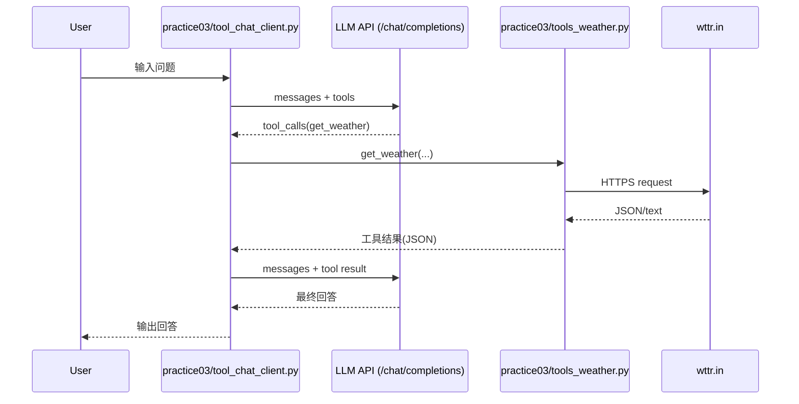
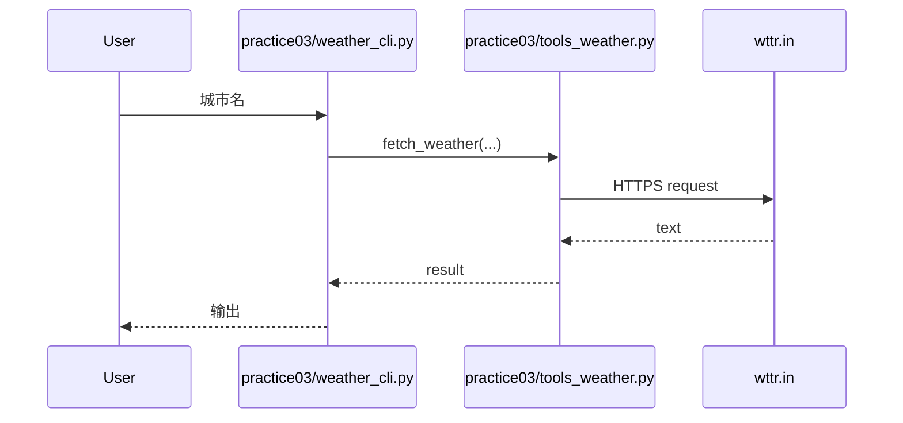

# PythonProject2

This project bootstraps a minimal OpenAI-compatible LLM call using only Python stdlib.

## Setup

1. Create and activate the virtual environment.
2. Copy `.env.example` to `.env` and fill in values.
3. Run the practice script.

## Quick start (Windows PowerShell)

```powershell
python -m venv .venv
.\.venv\Scripts\Activate.ps1
Copy-Item .env.example .env
notepad .env
python practice01\run_llm.py "Hello from practice01"
```

## Python files

- `main.py`: PyCharm 示例入口脚本，用于运行最小函数。教学目标：理解 `if __name__ == "__main__"` 的基本执行流与打印输出 / PyCharm sample entry script to run a minimal function. Teaching goal: understand the basic `if __name__ == "__main__"` flow and print output.
- `practice01/run_llm.py`: 读取 `.env`，构建 OpenAI 兼容的聊天请求，并使用 Python 标准库 HTTP 调用 LLM。教学目标：练习环境变量加载、请求负载构建、以及 JSON 响应与错误处理 / Reads `.env`, builds an OpenAI-compatible chat request, and calls the LLM via Python stdlib HTTP. Teaching goal: practice env loading, request payloads, and handling JSON responses/errors.
- `practice02/terminal_chat_stream.py`: 终端连续对话，支持流式输出与历史上下文 / Terminal chat loop with streaming output and history context.
- `practice02/tools_fs.py`: 5 个文件系统工具函数定义（列出、重命名、删除、写入、读取） / Five filesystem tools (list, rename, delete, write, read).
- `practice02/tool_chat_client.py`: 工具调用聊天客户端，自动调用文件系统工具 / Tool-calling chat client that dispatches filesystem tools.
- `practice03/tools_weather.py`: wttr.in 天气工具封装（get_weather） / wttr.in weather tool wrapper (get_weather).
- `practice03/tool_chat_client.py`: 天气工具调用聊天客户端 / Tool-calling chat client for weather.
- `practice03/weather_cli.py`: 直接命令行查询天气的小脚本 / Tiny CLI to query weather directly.
- `practice04/history_compress.py`: 聊天历史压缩与总结逻辑（超限触发） / Chat history compression and summarization logic (threshold-based).
- `practice04/terminal_chat_stream.py`: 支持自动总结压缩的终端聊天（流式输出） / Terminal chat with auto summarization and streaming output.
- `practice04/test_history_compress.py`: 历史压缩逻辑的轻量测试脚本 / Lightweight tests for history compression logic.

## Teaching docs

- `docs/lesson02_terminal_chat.md`: 终端聊天、流式输出、历史上下文与 Ctrl+C 退出的教学设计文档。

## Practice 02

```powershell
python practice02\terminal_chat_stream.py
```

## Practice 02 - Tool Calling

```powershell
python practice02\tool_chat_client.py
```

## Practice 03 - Weather Tool

```powershell
python practice03\weather_cli.py "青城山"
python practice03\tool_chat_client.py
```

## Practice 03 Call Sequence (Mermaid)





## Practice 04 - History Compression

```powershell
python practice04\terminal_chat_stream.py
```

```powershell
python practice04\test_history_compress.py
```

## Notes

- The script reads `.env` from the project root.
- Requests are sent to `{OPENAI_BASE_URL}/chat/completions`.
